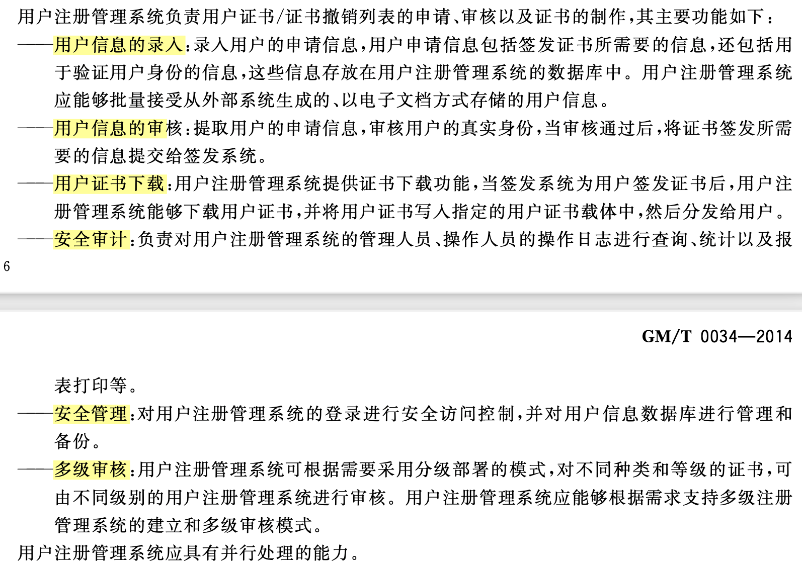
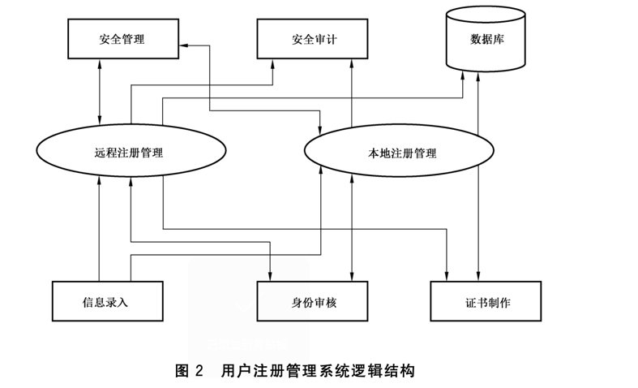

# 系统设计

包括总体设计和各子系统设计。

## 总体设计原则

证书认证系统的总体设计原则如下:
a)证书认证系统遵循标准化、**模块化**设计原则;
b)证书认证系统设置相对独立的功能模块,通过各模块之间的安全连接,实现各项功能;
c) 各模块之间的**通信采用基干身份鉴别机制**的安全通信协议: 
d)各模块使用的**密码运算都必须在密码设备中完成**;
e) 各模块产生的**审计日志文件**采用**统一的格式传递和存诸**: 
用户注册管理系统、证书/证书撤销列表生成与签发系统和密钥管理中心**可以设置独立的数据库**;
g) 证书认证系统的各模块应设置有效的**系统管理功能**; 
h) 系统必须具备**访问控制**功能; 
系统在实现证书管理功能的同时，必须充分考虑**系统本身的安全性**。

## 用户注册管理系统设计

### 用户注册管理系统功能

### 用户注册管理系统结构

### 证书/证书撤销列表生成与签发系统设计

#### 证书/证书撤销列表生成与签发系统功能

#### 证书/证书撤销列表生成与签发系统结构

### 证书/证书撤销列表存储发布系统设计

#### 证书/证书撤销列表存储发布系统功能

#### 证书/证书撤销列表存储发布系统结构	

### 证书状态查询系统设计

#### 证书状态查询系统功能

#### 证书状态查询系统结构

### 证书管理系统设计

### 证书安全系统设计

