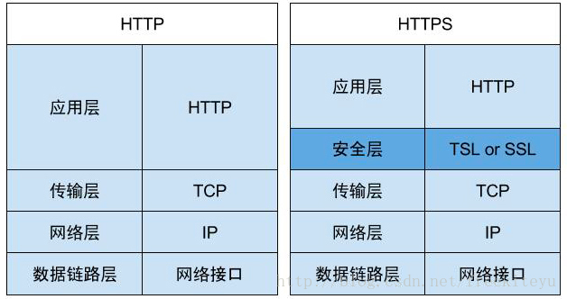
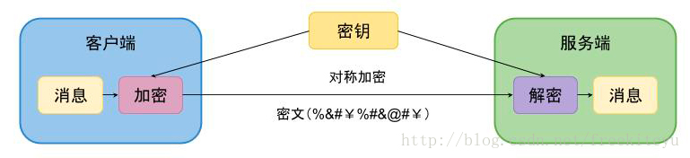
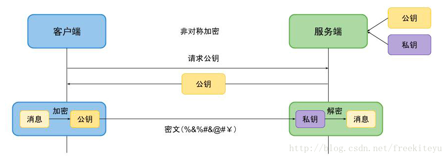
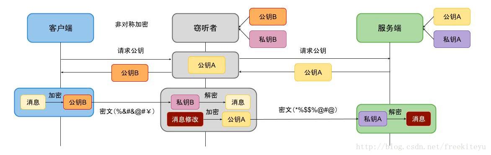
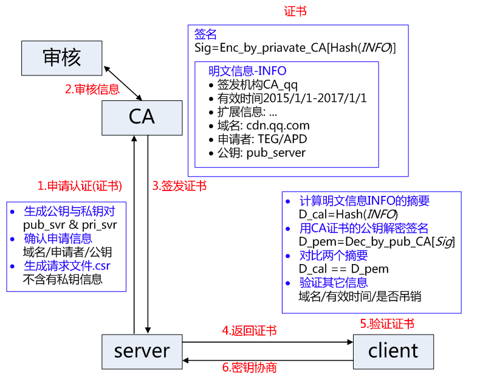
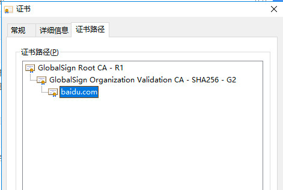
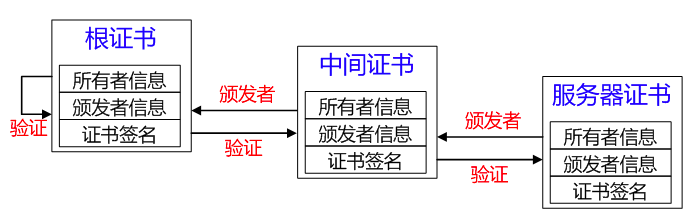
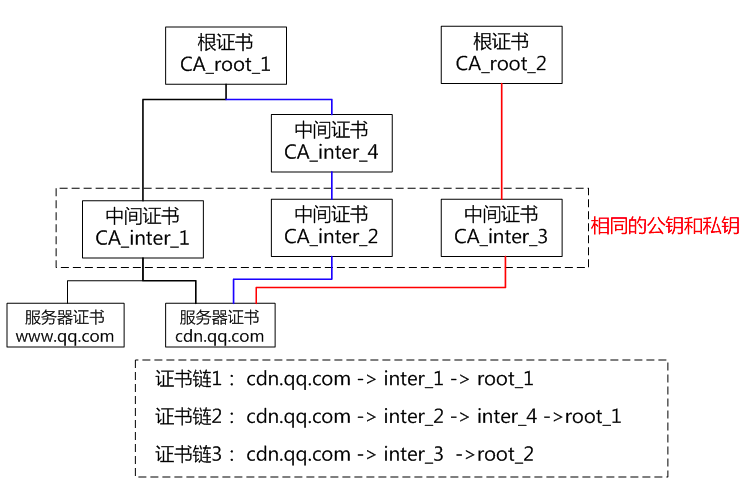

#  
PKI是Public Key Infrastructure的首字母缩写，翻译过来就是公钥基础设施；PKI是一种遵循标准的利用公钥加密技术为电子商务的开展提供一套安全基础平台的技术和规范。

X.509标准中，为了区别于权限管理基础设施(Privilege Management Infrastructure，简称PMI)，将PKI定义为支持公开密钥管理并能支持认证、加密、完整性和可追究性服务的基础设施]。

PKI 既不是一个协议，也不是一个软件，它是一个标准，在这个标准之下发展出的为了实现安全基础服务目的的技术统称为 PKI。

# PKI的组成部分
PKI（Public Key Infrastructure）公钥基础设施是提供公钥加密和数字签名服务的系统或平台，目的是为了管理密钥和证书。一个机构通过采用PKI框架管理密钥和证书可以建立一个安全的网络环境。

PKI 主要包括四个部分：
    X.509 格式的证书（X.509 V3） 和 证书废止列表CRL（X.509 V2）；
    CA 操作协议；
    CA 管理协议；
    CA 政策制定。

一个典型、完整、有效的PKI 应用系统至少应具有以下五个部分:

    1） 认证中心CA CA 是PKI 的核心，CA负责管理PKI 结构下的所有用户（包括各种应用程序）的证书，把用户的公钥和用户的其他信息捆绑在一起，在网上验证用户的身份，CA 还要负责用户证书的黑名单登记和黑名单发布，后面有CA 的详细描述。
    2） X.500 目录服务器 X.500 目录服务器用于发布用户的证书和黑名单信息，用户可通过标准的LDAP 协议查询自己或其他人的证书和下载黑名单信息。
    3） 具有高强度密码算法(SSL) 的安全WWW服务器 Secure socket layer(SSL)协议最初由Netscape 企业发展，现已成为网络用来鉴别网站和网页浏览者身份，以及在浏览器使用者及网页服务器之间进行加密通讯的全球化标准。
    4） Web（安全通信平台） Web 有Web Client 端和Web Server 端两部分，分别安装在客户端和服务器端，通过具有高强度密码算法的SSL协议保证客户端和服务器端数据的机密性、完整性、身份验证。
    5） 自开发安全应用系统 自开发安全应用系统是指各行业自开发的各种具体应用系统，例如银行、证券的应用系统等。

完整的PKI 包括认证政策的制定（包括遵循的技术标准、各CA 之间的上下级或同级关系、安全策略、安全程度、服务对象、管理原则和框架等）、认证规则、运作制度的制定、所涉及的各方法律关系内容以及技术的实现等。

作为WEB开发者其实只需要关注pki组成部分中的后三部分,高强度密码算法SSL目前已经包含在https中,下面对https有专门的讲解；web安全通信平台可以理解为我们的浏览器和服务器,即可以建立https连接的两个端点；自开发安全应用系统即是我们开发的支持pki验证的系统。

# HTTPS 详解

## HTTP VS HTTPS
使用HTTP有以下风险:

    窃听风险（eavesdropping）: 通信使用明文（不加密），内容可能会被窃听
    篡改风险（tampering）：不验证通信方的身份，因此有可能遭遇伪装
    冒充风险（pretending）：无法证明报文的完整性，所以有可能已遭篡改

当然,相对于HTTPS的安全性更高,HTTP也有自己的优势,即性能更好。

简单来说,HTTPS比HTTP增加了SSL握手和对于传输数据加密解密的过程,握手部分的耗时差不多为建立TCP连接耗时的3倍到6倍(取决于数字证书的加密强度),另外对于传输数据的加密解密也会占用设备一部分的性能。

## HTTPS/HTTP的区别和联系
HTTPS = HTTP+SSL / TLS

# 对称加密和非对称加密
## 对称加密

“加密”和“解密”使用相同的密钥。就好比用 7zip 或 WinRAR 创建一个带密码（口令）的加密压缩包。当你下次要把这个压缩文件解开的时候，你需要输入同样的密码。在这个例子中，密 码/口令就如同刚才说的“密钥”。

缺陷:对称加密的密钥如何传输,第一次传输的时候肯定是明文,那么对称密钥还是会存在被窃取的风险,以及客户端如何确认服务端的身份。

#### 对称加密经典算法：
AES，DES，3DES，TDEA，Blowfish，RC5，IDEA。

# 非对称加密

#### 非对称加密算法需要两个密钥：
公开密钥（public key）和私有密钥（private key）。

公开密钥与私有密钥是一对，如果用公开密钥对数据进行加密，只有用对应的私有密钥才能解密；如果用私有密钥对数据进行加密，那么只有用对应的公开密钥才能解密。因为加密和解密使用的是两个不同的密钥，所以这种算法叫作非对称加密算法。

#### 非对称加密算法实现机密信息交换的基本过程是：
    甲方生成一对密钥并将其中的一把作为公用密钥向其 它方公开；
    得到该公用密钥的乙方使用该密钥对机密信息进行加密后再发送给甲方；
    甲方再用自己保存的另 一把专用密钥对加密后的信息进行解密。

另一方面:

    甲方可以使用乙方的公钥对机密信息进行签名后再发送 给乙方；
    甲方再用自己的私匙对乙方发送回来的数据进行验签。

### 非对称加密经典算法：
RSA、Elgamal、背包算法、Rabin、D-H、ECC（椭圆曲线加密算法）。

缺陷:非对称加密可以解决对称加密被窃取的问题,但依然无法验证服务器的身份信息。

## 非对称加密被劫持情况

## 对称加密和非对称加密算法效率对比
### 对称加密(AES):

    AES加密的时间与被加密文件的大小正线性增长，加密1G的文件大概需要4分多钟，加密速度较快。
    
    加密后的文件大小是原始文件大小的两倍。
    
    解密文件所需时间是加密时间的两倍（这个应该是加密文件是原始文件大小两倍造成的）。

 加解密： 1:2

### 非对称加密(RSA):

    RSA加密算法加密时间很短，基本可以忽略不计。但是，在解密时，RSA显的比较慢，解密时间与解密文件 的大小呈现线性增长趋势。加密1M的文件大概需要5秒，但是解密却需要4分钟。
    
    加密后的文件与原始文件的大小基本相同。
    
    解密的效率远低于加密效率，按照这个时间去计算，加密1G的文件需要1分钟，但是解密却需要65小时。

## CA 认证
如何证明我们访问的网站就是我们要访问的网站,而不是他人伪造的,即中间人攻击和信息抵赖的问题,这里就用到了CA证书。

（1）CA认证，即电子认证服务 ，是指为电子签名相关各方提供真实性、可靠性验证的活动。

（2）证书颁发机构（CA, Certificate Authority）即颁发数字证书的机构。是负责发放和管理数字证书的权威机构，并作为电子商务交易中受信任的第三方，承担公钥体系中公钥的合法性检验的责任。

（3）CA中心为每个使用公开密钥的用户发放一个数字证书，数字证书的作用是证明证书中列出的用户合法拥有证书中列出的公开密钥。CA机构的数字签名使得攻击者不能伪造和篡改证书。在SET交易中，CA不仅对持卡人、商户发放证书，还要对获款的银行、网关发放证书。

（4）CA是证书的签发机构,它是PKI的核心。CA是负责签发证书、认证证书、管理已颁发证书的机关。它要制 定政策和具体步骤来验证、识别用户身份，并对用户证书进行签名，以确保证书持有者的身份和公钥的拥有权。

（5）CA 也拥有一个证书（内含公钥）和私钥。网上的公众用户通过验证 CA 的签字从而信任 CA ，任何人都可以得到 CA的证书（含公钥），用以验证它所签发的证书。

（5）如果用户想得到一份属于自己的证书，他应先向 CA 提出申请。在 CA 判明申请者的身份后，便为他分配一个公钥，并且 CA 将该公钥与申请者的身份信息绑在一起，并为之签字后，便形成证书发给申请者。

（6）如果一个用户想鉴别另一个证书的真伪，他就用 CA 的公钥对那个证书上的签字进行验证，一旦验证通过，该证书就被认为是有效的。

（7）为保证用户之间在网上传递信息的安全性、真实性、可靠性、完整性和不可抵赖性，不仅需要对用户的 身份真实性进行验证，也需要有一个具有权威性、公正性、唯一性的机构，负责向电子商务的各个主体颁发 并管理符合国内、国际安全电子交易协议标准的电子商务安全证，并负责管理所有参与网上交易的个体所需 的数字证书，因此是安全电子交易的核心环节。

### 引入权威的第三方机构CA(如沃通CA)
CA 负责核实公钥的拥有者的信息，并颁发认证"证书"，同时能够为使用者提供证书验证服务，即PKI体系(PKI基础知识)

#### 基本的原理: 
CA负责审核信息，然后对关键信息利用私钥进行"签名"，公开对应的公钥，客户端可以利用公钥验证签名。CA也可以吊销已经签发的证书，基本的方式包括两类 CRL 文件和 OCSP。

#### CA使用具体的流程如下：

    1. 服务方S向第三方机构CA提交公钥、组织信息、个人信息(域名)等信息并申请认证;
    
    2. CA通过线上、线下等多种手段验证申请者提供信息的真实性，如组织是否存在、企业是否合法，是否拥有域名的所有权等;
    
    3. 如信息审核通过，CA会向申请者签发认证文件-证书。
    
       证书包含以下信息：申请者公钥、申请者的组织信息和个人信息、签发机构CA的信息、有效时间、证书序列号等信息的明文，同时包含一个签名;
    
       签名的产生算法：首先，使用散列函数计算公开的明文信息的信息摘要，然后，采用CA的私钥对信息摘要进行加密，密文即签名;
    
    4. 客户端 C 向服务器 S 发出请求时，S 返回证书文件;
    
    5. 客户端 C 读取证书中的相关的明文信息，采用相同的散列函数计算得到信息摘要，然后，利用对应CA的公钥解密签名数据，对比证书的信息摘要，如果一致，则可以确认证书的合法性，即公钥合法;
    
    6. 客户端然后验证证书相关的域名信息、有效时间等信息;
    
    7. 客户端会内置信任CA的证书信息(包含公钥)，如果CA不被信任，则找不到对应 CA的证书，证书也会被判定非法。
    
    8. 在这个过程注意几点：
    
       a.申请证书不需要提供私钥，确保私钥永远只能服务器掌握;
    
       b.证书的合法性仍然依赖于非对称加密算法，证书主要是增加了服务器信息以及签名;
    
       c.内置 CA 对应的证书称为根证书，颁发者和使用者相同，自己为自己签名，即自签名证书（为什么说"部署自签SSL证书非常不安全"）
    
       d.证书=公钥+申请者与颁发者信息+签名;

即便有人截取服务器证书，再发给客户端，想冒充服务器，也无法实现。因为证书和url的域名是绑定的。

### 获取CA证书：
1. 从相关商业机构申请；
2. 使用证书工具生成(Keytool或者Openssl)

## 双向认证和单向认证
单向认证是指客户端根据服务器传过来的证书信息校验服务器的合法性,SSL握手流程就是单向认证。

### 服务器的合法性包括：
    1.证书是否过期。
    2.发行服务器证书的CA是否可靠。
    3.发行者证书的公钥能否正确解开服务器证书的"发行者的数字签名"。
    4.服务器证书上的域名是否和服务器的实际域名相匹配。

如果合法性验证没有通过,则浏览器会给用户一个警告提示访问网站不安全,让用户选择是继续访问还是终止访问。

双向认证是在单向认证的基础上,增加了一步服务器校验客户端证书的动作,这一步骤存在于SSL握手流程的第三步。
一般在对用户身份信息比较敏感的网站上会使用,比如银行系统的U盾,以及此次龙湾项目的PKI登陆。如果服务器校验客户端证书成功,则正常访问,如果失败,浏览器则会直接提示无法访问该网站。

## 服务器证书和客户端证书的区别与联系

服务器证书和客户端证书没有本质区别,都是一个包含公钥和私钥的文件。
但是并不建议二者交换使用,在上文的单向认证中的服务器合法性中会校验服务器证书上的域名和服务器的实际域名是否相匹配,而这个域名信息是服务器证书里面独有的,客户端证书中独有的信息是则是用户身份信息,如果二者交换使用,浏览器会提示服务器证书域名不匹配,那么该服务器证书则会不受信,也就失去了使用服务器证书的意义。

## 服务器证书和客户端证书如何建立信任关系
误区:: 以为服务器校验客户端证书是依赖于将每一个客户端证书的公钥导入服务器证书的证书库(即服务器证书文件)中

实际上服务器校验客户端证书是否合法是取决于服务器证书是否信任客户端证书的证书链。 也可以理解为服务器证书信任颁发客户端证书的CA。
在操作层面，这个建立这个信任关系也是将签发客户端证书的CA的公钥导入服务器证书；
但从原理层面来说,信任证书链的话只需要导入一次CA的公钥即可,而不用单独将每个客户端证书的公钥导入服务器证书。

我在开发过程中,甲方只给我一个服务器证书,并没有给客户端证书,为了模拟测试只能自己签发客户端证书,但自己签发的证书没有CA信息通过校验证书链肯定是不行的,这时候只能使用上面的导入客户端公钥的办法了,即先将自己生成的客户端证书中的公钥导出,然后将该公钥导入服务器证书中使服务器证书信任该公钥,这一点可以看后面的操作部分。

另外还有一点就是校验客户端证书时并没有做业务层面的判断,假如某CA签发了N个客户端证书,而服务器证书又信任这个CA的证书链,那么对于服务器证书来说,这些客户端证书是没有任何区别(因为都是受信的),如果想建立证书与用户之间的关系,还需要在代码层面来操作。

## 证书链

证书链可以有任意环节的长度，所以在三节的链中，信任锚证书CA 环节可以对中间证书签名；中间证书的所有者可以用自己的私钥对另一个证书签名。
CertPath API 可以用来遍历证书链以验证有效性，也可以用来构造这些信任链。

Web 浏览器已预先配置了一组浏览器自动信任的根 CA 证书。来自其他证书授权机构的所有证书都必须附带证书链，以检验这些证书的有效性。证书链是由一系列 CA 证书发出的证书序列，最终以根 CA 证书结束。

证书最初生成时是一个自签名证书。自签名证书是其签发者（签名者）与主题（其公共密钥由该证书进行验证的实体）相同的证书。如果拥有者向 CA 发送证书签名请求 (CSR)，然后输入响应，自签名证书将被证书链替换。链的底部是由 CA 发布的、用于验证主题的公共密钥的证书（回复）。链中的下一个证书是验证 CA 的公共密钥的证书。通常，这是一个自签名证书（即，来自 CA、用于验证其自身的公共密钥的证书）并且是链中的最后一个证书。

在其他情况下，CA 可能会返回一个证书链。在此情况下，链的底部证书是相同的（由 CA 签发的证书，用于验证密钥条目的公共密钥），但是链中的第二个证书是由其他 CA 签发的证书，用于验证您向其发送了 CSR 的 CA 的公共密钥。然后，链中的下一个证书是用于验证第二个 CA 的密钥的证书，依此类推，直至到达自签名的根证书。因此，链中的每个证书（第一个证书之后的证书）都需要验证链中前一个证书的签名者的公共密钥。

#### Windows系统中的证书链:

服务器证书、中间证书与根证书在一起组合成一条合法的证书链，证书链的验证是自下而上的信任传递的过程。

#### 二级证书结构存在的优势：
    a.减少根证书结构的管理工作量，可以更高效的进行证书的审核与签发;
    b.根证书一般内置在客户端中，私钥一般离线存储，一旦私钥泄露，则吊销过程非常困难，无法及时补救;
    c.中间证书结构的私钥泄露，则可以快速在线吊销，并重新为用户签发新的证书;
    d.证书链四级以内一般不会对 HTTPS 的性能造成明显影响。

#### 证书链特点：
    a.同一本服务器证书可能存在多条合法的证书链。因为证书的生成和验证基础是公钥和私钥对，如果采用相同的公钥和私钥生成不同的中间证书，针对被签发者而言，该签发机构都是合法的 CA，不同的是中间证书的签发机构不同;
    b.不同证书链的层级不一定相同，可能二级、三级或四级证书链。 中间证书的签发机构可能是根证书机构也可能是另一个中间证书机构，所以证书链层级不一定相同。

### 证书格式
DER/CER，文件是二进制格式，只保存证书，不保存私钥。

CRT，可以是二进制格式，可以是文本格式，与DER格式相同，不保存私钥。

PEM，一般是文本格式，可保存证书，可保存私钥。

PFX/P12，二进制格式，同时包含证书和私钥，一般有密码保护。

JKS，二进制格式，同时包含证书和私钥，一般有密码保护。

#### DER
该格式是二进制文件内容，Java 和 Windows 服务器偏向于使用这种编码格式。

    OpenSSL 查看:
    openssl x509 -in certificate.der -inform der -text -noout
    转换为 PEM：
    openssl x509 -in cert.crt -inform der -outform pem -out cert.pem

#### PEM
Privacy Enhanced Mai

    一般为文本格式，以 -----BEGIN----- 开头，以-----END----- 结尾。
    中间的内容是BASE64 编码。
    这种格式可以保存证书和私钥，有时我们也把PEM 格式的私钥的后缀改为 .key 以区别证书与私钥。
    具体你可以看文件的内容。这种格式常用于 Apache和 Nginx服务器。

    OpenSSL 查看：
    openssl x509 -in certificate.pem -text -noout
    转换为 DER：
    openssl x509 -in cert.crt -outform der -out cert.der

CRT
Certificate 的简称，有可能是 PEM 编码格式，也有可能是 DER 编码格式。如何查看请参考前两种格式。

PFX/P12
Predecessor of PKCS#12，这种格式是二进制格式，且证书和私钥存在一个 PFX 文件中。一般用于 Windows上的 IIS 服务器,window上可以直接安装。改格式的文件一般会有一个密码用于保证私钥的安全

    OpenSSL 查看：
    openssl pkcs12 -in for-iis.pfx
    转换为 PEM：
    openssl pkcs12 -in for-iis.pfx -out for-iis.pem -nodes

# 实操部分

## 生成证书
自己签发证书可以通过JDK自带的工具Keytool或者Linux上的openssl来进行,二者都很容易百度到相关资料,本文只对keytool方式进行简单讲解

## 生成服务器证书

## 生成客户端证书

## 让服务器信任客户端证书

## 让客户端信任服务器证书

