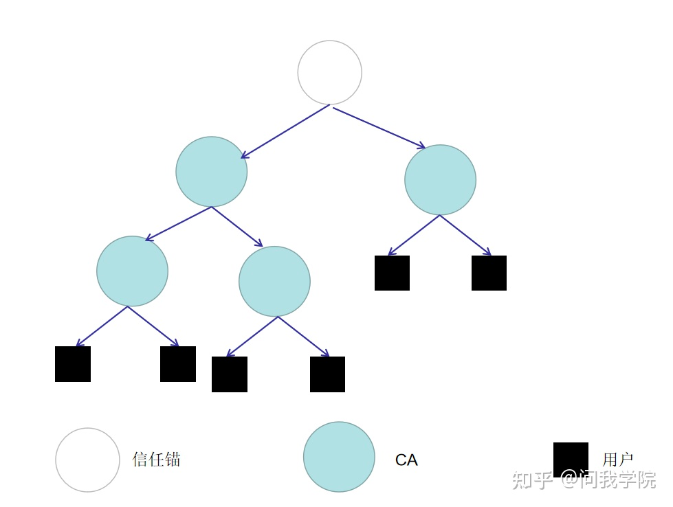

# 身份认证技术
身份认证技术是保护信息安全的第一道屏障，其核心技术是信息安全保障体系，也是最基本的环节。

它的基本思路：经过验证用户所具有的属性，来判断用户身份是否真实。根据不同的标准身份认证技术，分为四种类型。

#### 依据认证消息的不同性质，分为以下三种类型：
一是物理介质认证是通过被验证方出据其持有的物理介质来身份认证，包括信用卡和令牌卡等；
二是秘密知识验证是通讯两方应用一同拥有的秘密信息来身份认证，如口令、个人识别码等；
三是实体特征验证一方面是实体具有的物理特性，如硬盘的序列号等，另一方面是个体的生物学特性，如指纹和声音等。

# 常用的身份认证方法
## 基于口令的身份认证技术

## 基于生物特征的身份认证技术

## 基于 PKI 的身份认证技术
其基本原理是：第三方权威机构—身份认证中心 CA，将用户所持有的公开密钥与其身份信息（如名称、电话等）结合在一起。在两者相结合之前，由身份认证中心 CA 证实用户身份的真实性，而后身份认证中心 CA 给用户及其公开密钥捆绑的证书签名，则签名证书有效。

每个用户均拥有一对公钥和私钥，其中公钥在网络中是公开的，用于文件发送时对信息进行加密；私钥是保密的，只归用户所有，用于对文件信息进行解密和签名。

当准备发送消息时，发送方使用接收方的公开密钥加密要传输的数据，接收方得到数据后用其所持有的私有密钥来解密数据。

基于 PKI 的身份认证技术选用公开密钥技术，数字签名具有不可复制性，且数据得到完整和保密的保护。
PKI 采用数字证书方式，由第三方可信任机构CA 颁发数字证书，同时存储在 USB Key、IC 智能卡等独立设备中，不在网络上传输，无需在线查询数字证书，即可证明用户的身份，能够扩展用户扩大服务范围，可以为大用户群服务。
PKI 技术提供数字证书的恢复和撤销机制，如果用户的数字证书丢失或用户信息改变等情况，可以对恢复或撤销数字证书，防止数字证书被窃取或被恶意盗用。
基于 PKI 的身份认证技术具有灵活性、可扩展性。

## PKI 相关技术

### 对称密钥加密技术
AES
### 非对称密钥加密技术
RSA    
### 消息摘要
输入不同长度的原文数据经过同一个消息摘要算法计算，所得到的消息摘要的长度是一样的，即消息摘要的长度不因输入的原文数据的多或少而改变。

    一是不使用密钥进行加密；
    二是如果需要得到相同的加密过的密文数据，要满足两个条件，使用同一个消息摘要算法和提供同一个原文数据；
    三是经加密完成的数据是无法被逆向解密的。消息摘要算法的适应范围很广，主要包括分布式网络等。

不同的算法都有各自固定长度，如 MD5 算法为 128 个比特位，SHA-1 为 192和 256 比特位。
消息摘要应用的是单向函数，只能将原文数据计算出消息摘要，但是不能依据消息摘要逆向得到原文数据，甚至是找不到原文数据任何相关信息。

消息摘要算法对构造数字签名方案起到重要作用，通过它计算得到的消息摘要与原文数据紧密相关。

### 数字证书
接收方利用发送方的公钥解密对方的数字签名，来验证信息是否是由发送方所提供，但却无法证实发送方与其所声明的数据的拥有者是一致的。
同时，虽然公钥是公开的，但是不排除有安全漏洞，数字签名有可能被伪造。

目前主要是采用签发数字证书来解决以上问题。

数字证书实际上是由认证中心颁发的包含证书持有人的真实身份信息、公开密钥信息等信息一段数据。
而且其功能与日常用的居民身份证相似，身份认证机构签发的数字签名可以保障数字证书信息的真实性。
数字证书持有者有一个仅为本人所有的私钥，用它对要传输的信息进行签名，或对接收到的信息进行解密；同时由本人公开一个公钥，共享给有通信需要的一组用户，用来对信息进行加密和验证签名。

#### 数字证书的颁发流程：
 1.用户在向身份认证中心提出申请前，必须生成自己的一对密钥，然后将包含本人身份信息和公钥的申请发送给认证中心

 2.认证中心首先对用户提供的相关相信进行核实，这个过程中要执行关键的步骤来确认该申请是用户本人发送的

 3.认证中心向申请用户颁发数字证书，证书中储存用户名称、公钥等相关信息，数字签名信息。

 4.持有数字证书的用户就可以进行数据传输、网上银行等相关的活动。

#### 数字证书有以下三个特点:

1. 它是 PKI 体系的元件。PKI 体系所提供的所有安全服务都是以数字证书为应用主体的，系统运行过程中的各个步骤都离不开数字证书，可以说数字证书是 PKI 的核心组件。

2. 数字证书具有权威性。它是由权威的、可信赖的和公正的第三方身份认证中心 CA 颁发的认证中心 CA 为特定的应用网络和用户提供身份认证服务，负责验证公钥的合法性，证明用户是证书的合法持有者，同时，签发、分配、储存、更新和删除证书。

3. 数字证书不仅装载用户的公钥而且证明用户身份。 目前数字证书的格式普遍遵循 X.509V3 国际标准，证书包括证书的版本号、序列号、算法、命名规则通常采用 X.500 格式、有效日期、名称、公钥信息、数字证书颁发者标识符。 X.509V3 数字证书包括扩展标识符、关键程度指示器和扩展字段值。数字证书扩展包括密钥信息、政策信息等。

### 数字签名
数字签名就是数据的发送方用密码算法加密一段数据，处理生成一段符加数据同原始数据一起发送给接收方。

数字签名用来证明发送方数据的真实性。因为公钥是对一定范围的用户公开的，所以多个人可以用公钥加密数据，接收方可以利用数字签名确认发送方的身份。在密码系统安全的情况下，接收方可以通过此方法鉴定发送方的真实身份。

数字签名保证传输数据的完整性，防止数据发送方的身份被伪造，防止数据在传输过程中被第三方采取非法手段进行截获、修改、转发。

数字签名确保交易的不可抵赖性。应用数字签名后，发送方无法不承认曾传输过数据，数据的接收方能够用数字签名来证明数据的发送方。

### 杂凑值数字签名
杂凑函数具有单向性、强无碰撞性、求第二原像不可行性。任意长度的数据经过 Hash 算法加密压缩，都会生成一个指定长度的杂凑值

#### 杂凑值数字签名的过程是：
    一是用 Hash 算法加密原文数据，生成固定长度的杂凑值；
    二是用发送方自己的私钥加密该杂凑值生成数字签名，传输给接收方；
    三是接收方用发送方的公钥解密第二步生成的数字签名，反向计算获得第一步生成的杂凑值，用同一种 Hash 算法永计算数据，获得另一个杂凑值，对比两个值，如果相同，说明该数据就是发送方签名后发送给接收方的，否则，就不是发送方所传送的数据，不能信任。

### 私钥签名

私钥签名利用非对称加密算法的私钥加密原文数据，它是一种对整体消息的签名，适用于小文件信息。

首先发送方用自己的私钥对数据进行加密处理，生成数字签名，再把原文数据与生成的数字签名相捆绑共同传输给接收方，因为接收方拥有发送方对外公开的与其相匹配的公钥，用这个公钥解密收到的信息，然后比较解密后的数据与捆绑中的原文数据，由此来证明接收方收到的数据确实是其所声称的发送方所提供的。

### 数字信封

发送方使用对称密钥加密数据，然后使用收件方的公钥加密对称密钥，产生一个数字信封，发送到收件方。
因为匹配的公私密钥对对应一个固定的用户的数字信封，所以只有指定的接收者可以打开数字信封，用获得的密钥对解密数字信封 ，得到原文数据。

数字信封具有非常高的安全性。一是数字信封的打包，用收件方的公钥加密要传输的信息，只能是收件方的私钥将该信息复原；二是数字信封的拆解，即利用私钥将经过加数据解密。

数字信封能够保障真实和完整的传输数据。因为数字信封的功能接近于生活中使用的普通信封，它用密码加密技术保护数据，规定指定的接收方能够解密数据，获得原文数据。

数字信封结合对称密钥加密技术的高效性、安全性，克服该技术发放密钥过程的复杂性，结合非对称密钥加密技术的灵活性，避免该技术对数据进行加密需要非常长时间的困扰，保证数据传输的完整性、真实性、高效性。

# 基于 PKI 的数字证书身份认证体系

## PKI 体系的组成

## CA 证书

### CA概述

### CA 信任模型

### CA 的功能

