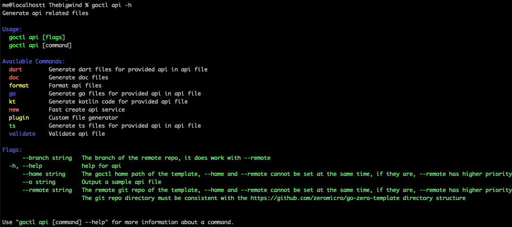
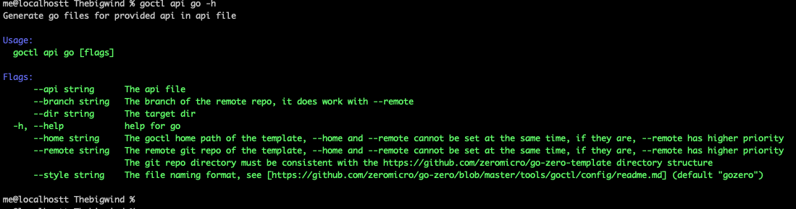

goctl api是goctl中的核心模块之一，其可以通过.api文件一键快速生成一个api服务

# api命令说明

    me@localhostt Thebigwind % goctl api -h
    Generate api related files
    
    Usage:
    goctl api [flags]
    goctl api [command]
    
    Available Commands:
    dart        Generate dart files for provided api in api file
    doc         Generate doc files
    format      Format api files
    go          Generate go files for provided api in api file
    kt          Generate kotlin code for provided api file
    new         Fast create api service
    plugin      Custom file generator
    ts          Generate ts files for provided api in api file
    validate    Validate api file
    
    Flags:
    --branch string   The branch of the remote repo, it does work with --remote
    -h, --help            help for api
    --home string     The goctl home path of the template, --home and --remote cannot be set at the same time, if they are, --remote has higher priority
    --o string        Output a sample api file
    --remote string   The remote git repo of the template, --home and --remote cannot be set at the same time, if they are, --remote has higher priority
    The git repo directory must be consistent with the https://github.com/zeromicro/go-zero-template directory structure
    
    
    Use "goctl api [command] --help" for more information about a command.
    

#### go子命令，其功能是生成golang api服务，我们通过goctl api go -h看一下使用帮助：

    me@localhostt Thebigwind % goctl api go -h
    Generate go files for provided api in api file
    
    Usage:
    goctl api go [flags]
    
    Flags:
    --api string      The api file
    --branch string   The branch of the remote repo, it does work with --remote
    --dir string      The target dir
    -h, --help            help for go
    --home string     The goctl home path of the template, --home and --remote cannot be set at the same time, if they are, --remote has higher priority
    --remote string   The remote git repo of the template, --home and --remote cannot be set at the same time, if they are, --remote has higher priority
    The git repo directory must be consistent with the https://github.com/zeromicro/go-zero-template directory structure
    --style string    The file naming format, see [https://github.com/zeromicro/go-zero/blob/master/tools/goctl/config/readme.md] (default "gozero")
    
    me@localhostt Thebigwind %

    create the API file, like greet.api
    type (
    Request {
    Name string `path:"name,options=you|me"` // parameters are auto validated
    }
    
    Response {
    Message string `json:"message"`
    }
    )
    
    service greet-api {
    @handler GreetHandler
    get /greet/from/:name(Request) returns (Response)
    }

the .api files also can be generated by goctl, like below:

    goctl api -o greet.api

generate the go server-side code:
    
    goctl api go -api greet.api -dir greet

the generated files look like:

    ├── greet
    │    ├── etc
    │    │    └── greet-api.yaml        // configuration file
    │    ├── greet.go                  // main file
    │    └── internal
    │        ├── config
    │        │   └── config.go         // configuration definition
    │     ├── handler
    │     │ ├── greethandler.go   // get/put/post/delete routes are defined here
    │     │ └── routes.go         // routes list
    │     ├── logic
    │     │ └── greetlogic.go     // request logic can be written here
    │     ├── svc
    │     │ └── servicecontext.go // service context, mysql/redis can be passed in here
    │     └── types
    │         └── types.go          // request/response defined here
    └── greet.api                     // api description file

generated code can be run directly:

    cd greet
    go mod init
    go mod tidy
    go run greet.go -f etc/greet-api.yaml

默认侦听在 8888 端口（可以在配置文件里修改），可以通过 curl 请求：

    curl -i http://localhost:8888/from/you

返回如下：

    HTTP/1.1 200 OK
    Content-Type: application/json
    Date: Thu, 22 Oct 2020 14:03:18 GMT
    Content-Length: 14
    
    {"message":""}

#### 编写业务代码：

 1.api 文件定义了服务对外 HTTP 接口，可参考 api 规范
 https://github.com/zeromicro/zero-doc/blob/main/docs/zero/goctl-api.md

 2.可以在 servicecontext.go 里面传递依赖给 logic，比如 mysql, redis 等

 3.在 api 定义的 get/post/put/delete 等请求对应的 logic 里增加业务处理逻辑