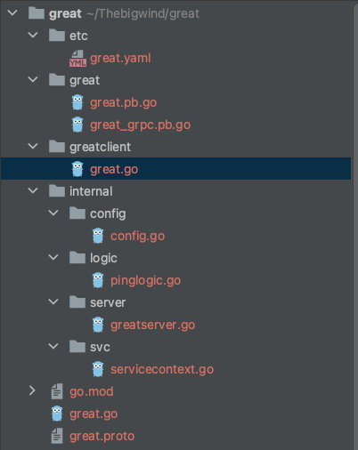

## 方式一：快速生成greet服务

通过命令 goctl rpc new ${servieName}生成
如生成greet rpc服务：

    $ goctl rpc new greet

执行后代码结构如下:

    cd greet && tree
    .
    ├── etc
    │   └── greet.yaml
    ├── go.mod
    ├── go.sum
    ├── greet
    │   ├── greet.go
    │   ├── greet.pb.go
    │   └── greet_grpc.pb.go
    ├── greet.go
    ├── greet.proto
    └── internal
    ├── config
    │   └── config.go
    ├── logic
    │   └── pinglogic.go
    ├── server
    │   └── greetserver.go
    └── svc
    └── servicecontext.go

## 方式二：通过指定proto生成rpc服务

### 生成proto模板

    $ goctl rpc template -o=user.proto

        syntax = "proto3";
        
        package user;
        option go_package="./user";
        
        message Request {
        string ping = 1;
        }
        
        message Response {
        string pong = 1;
        }
        
        service User {
        rpc Ping(Request) returns(Response);
        }

### 生成rpc服务代码

    $ goctl rpc protoc user.proto --go_out=. --go-grpc_out=. --zrpc_out=.

## rpc服务生成用法：
    me@localhostt great % goctl rpc protoc -h
    Generate grpc code
    
    Usage:
    goctl rpc protoc [flags]
    
    Examples:
    goctl rpc protoc xx.proto --go_out=./pb --go-grpc_out=./pb --zrpc_out=.
    
    Flags:
    --branch string     The branch of the remote repo, it does work with --remote
    -h, --help              help for protoc
    --home string       The goctl home path of the template, --home and --remote cannot be set at the same time, if they are, --remote has higher priority
    -m, --multiple          Generated in multiple rpc service mode
    --remote string     The remote git repo of the template, --home and --remote cannot be set at the same time, if they are, --remote has higher priority
    The git repo directory must be consistent with the https://github.com/zeromicro/go-zero-template directory structure
    --style string      The file naming format, see [https://github.com/zeromicro/go-zero/tree/master/tools/goctl/config/readme.md] (default "gozero")
    -v, --verbose           Enable log output
    --zrpc_out string   The zrpc output directory
    
    me@localhostt great %

zrpc 代码生成是用 goctl rpc $protoc_command --zrpc_out=${output} 模板，

如原来生成 grpc 代码指令为

    $ protoc user.proto --go_out=. --go-grpc_out=.

则生成 zrpc 代码指令就为

    $ goctl rpc protoc user.proto --go_out=. --go-grpc_out=. --zrpc_out=.

###TIP
1.--go_out 与 --go-grpc_out 生成的最终目录必须一致

2.--go_out & --go-grpc_out 和 --zrpc_out 的生成的最终目录必须不为同一目录，否则pb.go和_grpc.pb.go就与main函数同级了，这是不允许的。 --go_out 与 --go-grpc_out 生产的目录会受 --go_opt 和 --grpc-go_opt 和proto源文件中 go_package值的影响，要想理解这里的生成逻辑，建议阅读 
  官方文文档：Go Generated Code https://developers.google.com/protocol-buffers/docs/reference/go-generated

## 开发人员需要做什么
关注业务代码编写，将重复性、与业务无关的工作交给goctl，生成好rpc服务代码后，开发人员仅需要修改

    服务中的配置文件编写(etc/xx.json、internal/config/config.go)
    服务中业务逻辑编写(internal/logic/xxlogic.go)
    服务中资源上下文的编写(internal/svc/servicecontext.go)

##注意事项#
    
1.proto暂不支持多文件同时生成
    
2.proto不支持外部依赖包引入，message不支持inline
    
3.目前main文件、shared文件、handler文件会被强制覆盖，而和开发人员手动需要编写的则不会覆盖生成，这一类在代码头部均有
    
    // Code generated by goctl. DO NOT EDIT!
    // Source: xxx.proto
    的标识，请注意不要在里面写业务性代码;也不要将它写在业务性代码里面。

## proto import#
对于rpc中的requestType和returnType必须在main proto文件定义，对于proto中的message可以像protoc一样import其他proto文件。

