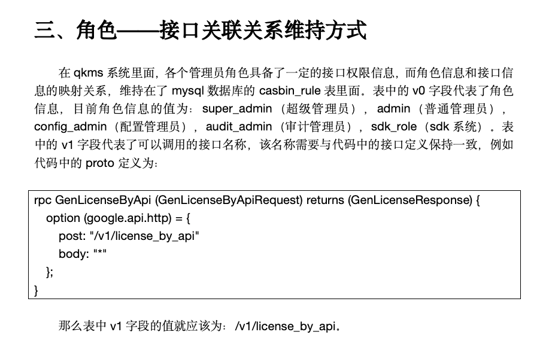

mysql> describe casbin_rule;
+-------+-----------------+------+-----+---------+----------------+
| Field | Type            | Null | Key | Default | Extra          |
+-------+-----------------+------+-----+---------+----------------+
| id    | bigint unsigned | NO   | PRI | NULL    | auto_increment |
| ptype | varchar(100)    | YES  | MUL | NULL    |                |
| v0    | varchar(100)    | YES  |     | NULL    |                |
| v1    | varchar(100)    | YES  |     | NULL    |                |
| v2    | varchar(100)    | YES  |     | NULL    |                |
| v3    | varchar(100)    | YES  |     | NULL    |                |
| v4    | varchar(100)    | YES  |     | NULL    |                |
| v5    | varchar(100)    | YES  |     | NULL    |                |
+-------+-----------------+------+-----+---------+----------------+
8 rows in set (0.00 sec)

mysql> select * from casbin_rule limit 4;
+-----+-------+-------+----------+--------+------+------+------+
| id  | ptype | v0    | v1       | v2     | v3   | v4   | v5   |
+-----+-------+-------+----------+--------+------+------+------+
| 200 | p     | admin | /v1/apps | DELETE | NULL | NULL | NULL |
| 201 | p     | admin | /v1/apps | GET    | NULL | NULL | NULL |
| 202 | p     | admin | /v1/apps | GET    | NULL | NULL | NULL |
| 203 | p     | admin | /v1/apps | GET    | NULL | NULL | NULL |
+-----+-------+-------+----------+--------+------+------+------+
4 rows in set (0.00 sec)

mysql>

mysql> select * from sys_roles limit 3;
+----+--------------+-----------------+-----------+----------------+-----------+-------------------------+-------------------------+
| id | role_id      | role_name       | parent_id | default_router | deletable | created_at              | updated_at              |
+----+--------------+-----------------+-----------+----------------+-----------+-------------------------+-------------------------+
|  1 | super_admin  | 超级管理员      | 0         | dashboard      |         1 | 2022-04-10 08:17:39.642 | 2022-04-10 08:17:39.642 |
|  2 | admin        | 系统管理员      | 0         | dashboard      |         1 | 2022-04-10 08:17:39.642 | 2022-05-12 01:59:17.886 |
|  3 | config_admin | 安全管理员      | 0         | dashboard      |         1 | 2022-04-10 08:17:39.642 | 2022-04-29 08:49:45.721 |
+----+--------------+-----------------+-----------+----------------+-----------+-------------------------+-------------------------+
3 rows in set (0.00 sec)

mysql> select * from sys_user_role limit 3;
+-------------------+-----------------------+
| sys_user_id       | sys_authority_role_id |
+-------------------+-----------------------+
| zdlzdev@zdlz.tech | super_admin           |
+-------------------+-----------------------+
1 row in set (0.00 sec)

mysql>

mysql> select * from sys_resource_apis limit 3;
+----+------------------+-----------------------------------+--------------+--------+-------------------------+-------------------------+------------+
| id | path             | description                       | api_group    | method | created_at              | updated_at              | deleted_at |
+----+------------------+-----------------------------------+--------------+--------+-------------------------+-------------------------+------------+
| 88 | /v1/app_list     | 接入应用列表接口                  | 接入应用     | GET    | 2022-04-10 15:41:28.000 | 2022-04-10 15:41:28.000 | NULL       |
| 89 | /v1/app_topology | 设备查询接口                      | 接入应用     | GET    | 2022-04-10 15:41:28.000 | 2022-04-10 15:41:28.000 | NULL       |
| 90 | /v1/app_total    | 接入应用总数量查询接口            | 接入应用     | GET    | 2022-04-10 15:41:28.000 | 2022-04-10 15:41:28.000 | NULL       |
+----+------------------+-----------------------------------+--------------+--------+-------------------------+-------------------------+------------+
3 rows in set (0.01 sec)

mysql> select * from sys_resource_menus limit 3;
+----+------------+----------+--------------+-----------+--------+------+-------------------------+-------------------------+------------+
| id | menu_level | path     | name         | parent_id | hidden | sort | created_at              | updated_at              | deleted_at |
+----+------------+----------+--------------+-----------+--------+------+-------------------------+-------------------------+------------+
|  1 |          1 | #/       | 数据大盘     | NULL      |   NULL | NULL | 2022-04-10 15:41:28.000 | 2022-04-10 15:41:28.000 | NULL       |
|  2 |          1 | #/qrng   | QRNG设备     | NULL      |   NULL | NULL | 2022-04-10 15:41:28.000 | 2022-04-10 15:41:28.000 | NULL       |
|  4 |          1 | #/config | 参数配置     | NULL      |   NULL | NULL | 2022-04-10 15:41:28.000 | 2022-04-10 15:41:28.000 | NULL       |
+----+------------+----------+--------------+-----------+--------+------+-------------------------+-------------------------+------------+
3 rows in set (0.00 sec)

mysql> select * from sys_resource_btns limit 3;
+----+-------------------------+-------------------------+------------+--------------------+------------------------+------------------+
| id | created_at              | updated_at              | deleted_at | name               | desc                   | sys_base_menu_id |
+----+-------------------------+-------------------------+------------+--------------------+------------------------+------------------+
|  6 | 2022-04-10 15:48:59.000 | 2022-04-10 15:48:59.000 | NULL       | Qrng_muti_forzen   | Qrng批量冻结           |                2 |
|  7 | 2022-04-10 15:48:59.000 | 2022-04-10 15:48:59.000 | NULL       | Qrng_muti_unforzen | Qrng批量解冻           |                2 |
|  8 | 2022-04-10 15:48:59.000 | 2022-04-10 15:48:59.000 | NULL       | Qrng_status_change | Qrng单体状态修改       |                2 |
+----+-------------------------+-------------------------+------------+--------------------+------------------------+------------------+
3 rows in set (0.00 sec)

mysql>

配置角色的接口权限

INSERT INTO `qskm`.`casbin_rule` (`ptype`, `v0`, `v1`, `v2`, `v3`, `v4`, `v5`) VALUES ('p', 'super_admin', '/v1/home_page', 'GET', NULL, NULL, NULL);
INSERT INTO `qskm`.`casbin_rule` (`ptype`, `v0`, `v1`, `v2`, `v3`, `v4`, `v5`) VALUES ('p', 'admin', '/v1/home_page', 'GET', NULL, NULL, NULL);

