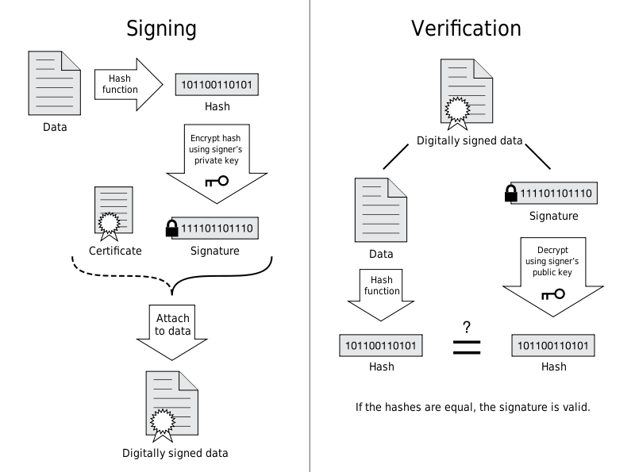
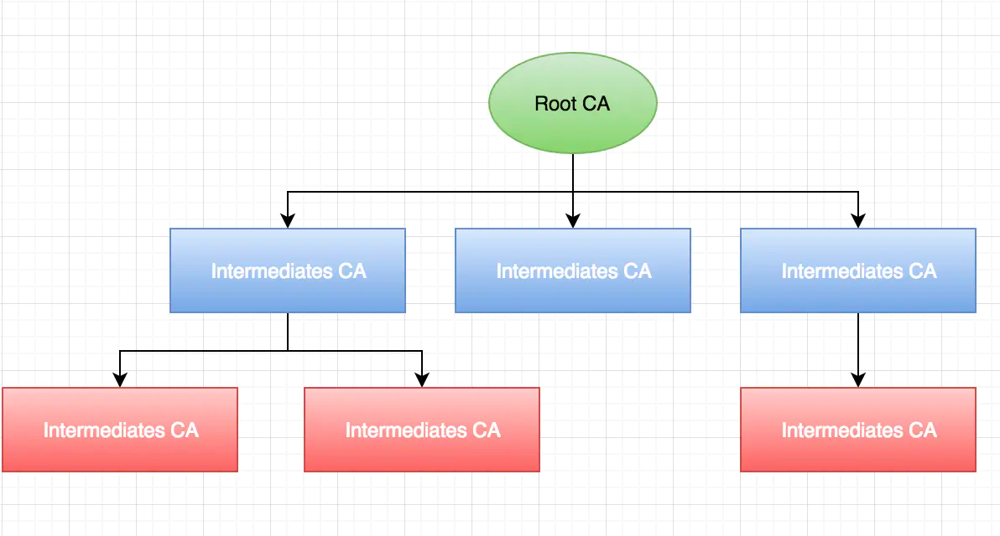
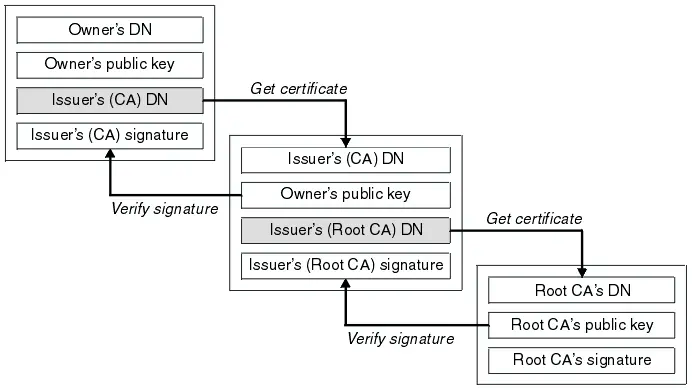

证书是用来认证公钥持有者的身份的电子文档，防止第三方进行冒充。一个证书中包含了公钥、持有者信息、证明证书内容有效的签名以及证书有效期，
还有一些其他额外信息。

数字证书：
数字证书则是由证书认证机构（CA）对证书申请者真实身份验证之后，用CA的根证书对申请人的一些基本信息以及申请人的公钥进行签名（相当于加盖发证书机构的公章）后形成的一个数字文件。

数字证书就是经过CA认证过的公钥，而私钥一般情况都是由证书持有者在自己本地生成的，由证书持有者自己负责保管。

CA
我们用证书来认证公钥持有者的身份，那证书是怎么来的呢？又该怎么认证证书呢？这涉及到一个称之为PKI(Public key certificate)的规范体系，
包含了数字证书，公钥管理以及验证等技术，详细可以参考：https://en.wikipedia.org/wiki/Public_key_certificate
同样参考Wikipedia上的概念，In cryptography, a certificate authority or certification authority (CA) is an entity that 
issues digital certificates. (https://en.wikipedia.org/wiki/Certificate_authority) ，简单来说，CA就是签发电子证书的实体。

证书的签发(Signing)和认证(Verification)的过程：
这两个过程也是基于公钥与私钥的，签发和认证的过程跟传输信息过程中的加密解密过程非常类似。签名密文(Signature)是一个重要凭证，
Signature与签发人的公钥一同传输，可以避免中间人在获取证书时对证书内容的篡改。

签发证书的步骤：

1.Signing阶段，首先撰写证书的元信息：签发人(Issuer)、地址、签发时间、过期失效等；当然，这些信息中还包含证书持有者(owner)的基本信息，例如owner的DN(DNS Name，即证书生效的域名)，owner的公钥等基本信息。
2.通过通用的Hash算法将信息摘要提取出来；
3.Hash摘要通过Issuer(CA)私钥进行非对称加密，生成一个签名密文；
4.将签名密文attach到文件证书上，使之变成一个签名过的证书。

验证证书的步骤：

1.Verification阶段，浏览器获得之前签发的证书；
2.将其解压后分别获得“元数据”和“签名密文”；
3.将同样的Hash算法应用到“元数据”获取摘要；
4.将密文通过Issuer(CA)的公钥（非对称算法，私钥加密，公钥解密）解密获得同样的摘要值。
5.比对两个摘要，如果匹配，则说明这个证书是被CA验证过合法证书，里面的公钥等信息是可信的。

在Verification阶段，解密Signature获得摘要需要通过签发者(Issuer)的公钥，又该如何获得这个公钥，同时确保这个公钥是有效的呢？就是下面的证书链的内容

证书链

证书有3类：

end-user ：baidu.com 包含用来加密传输数据的公钥的证书，是HTTPS中使用的证书
intermediates：CA用来认证公钥持有者身份的证书，即确认HTTPS使用的end-user证书是属于baidu.com的证书。这类intermediates证书甚至可以有很多级。
root：用来认证intermediates证书是合法证书的证书。

简单来说，end-user证书上面几级证书都是为了保证end-user证书未被篡改，保证是CA签发的合法证书，进而保证end-user证书中的公钥未被篡改。

CA组织

CA也分了两种类型：root CAs 和 intermediates CAs。
首先，CA的组织结构是一个树结构，一个root CAs下面包含多个intermediates CAs，而intermediates又可以包含多个intermediates CAs。
root CAs 和 intermediates CAs都可以颁发证书给用户，颁发的证书分别是root Certificates和intermediates Certificates，
最终用户用来认证公钥的证书则被称为end-user Certificates。

我们使用end-user certificates来确保加密传输数据的公钥(public key)不被篡改，而又如何确保end-user certificates的合法性呢？
这个认证过程跟公钥的认证过程类似，首先获取颁布end-user certificates的CA的证书，然后验证end-user certificates的signature。
一般来说，root CAs不会直接颁布end-user certificates的，而是授权给多个二级CA，而二级CA又可以授权给多个三级CA，这些中间的CA就是
intermediates CAs，它们才会颁布end-user certificates。

但是intermediates certificates的可靠性又如何保证呢？这就是涉及到证书链，Certificate Chain ，链式向上验证证书，直到Root Certificates

root certificates

除了可以下载安装之外，device（例如浏览器，操作系统）都会内置一些root certificates，称之为trusted root certificates，
https://support.dnsimple.com/articles/what-is-ssl-certificate-chain/

