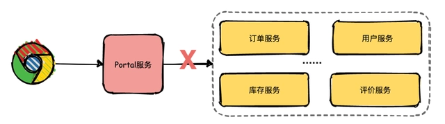
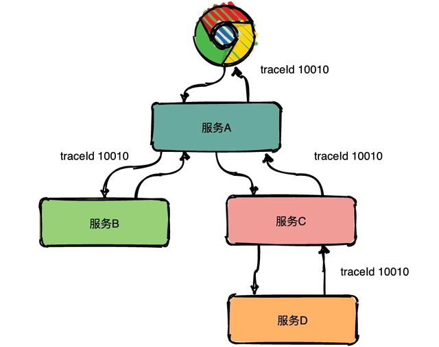
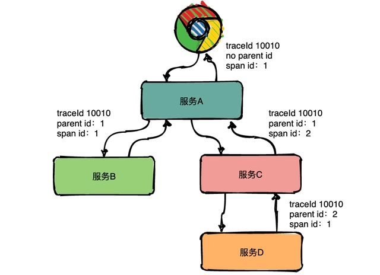
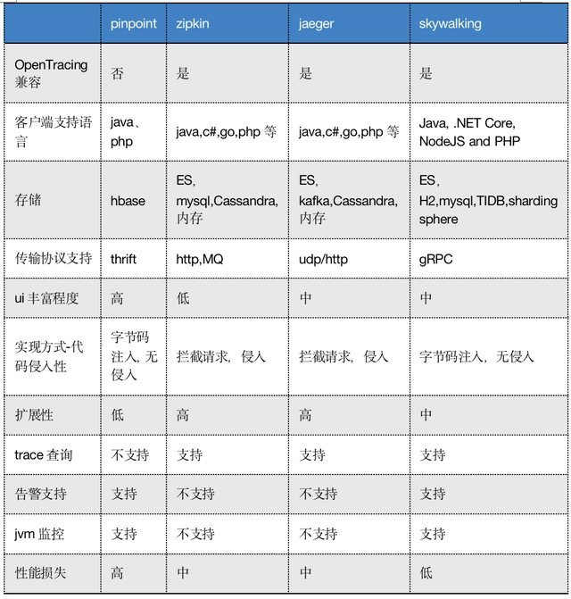
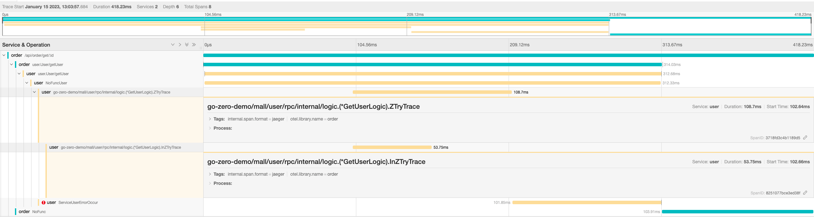

单体架构拆分为微服务、服务内缓存变为分布式缓存、服务组件通信变为分布式消息，组件变多后，出现一个问题，往往需要观察多组件的运行状况以定位问题，这时系统引入链路追踪技术，在一定程度上，方便从整体上定位问题。

微服务架构（极简版）假如现在有一个系统部署了多个服务，用户通过浏览器在主界面上下下单某一商品，结果系统给用户提示：系统内部错误，相信用户是很崩溃的。
运营人员将问题抛给开发人员定位，开发人员只知道有异常，但是这个异常具体是由哪个微服务引起的就需要逐个服务排查了。

界面出现异常难以排查后台服务开发人员借助日志逐个排查的效率是非常低的，那有没有更好的解决方案了？
答案是引入链路追踪系统。

1.什么是链路追踪？
分布式链路追踪就是将一次分布式请求还原成调用链路，将一次分布式请求的调用情况集中展示，比如各个服务节点上的耗时、请求具体到达哪台机器上、每个服务节点的请求状态等等。
链路跟踪主要功能：
故障快速定位：可以通过调用链结合业务日志快速定位错误信息。链路性能可视化：各个阶段链路耗时、服务依赖关系可以通过可视化界面展现出来。链路分析：通过分析链路耗时、服务依赖关系可以得到用户的行为路径，汇总分析应用在很多业务场景。
链路追踪系统最早是由Goggle公开发布的一篇论文
《Dapper, a Large-Scale Distributed Systems Tracing Infrastructure》
在这篇著名的论文中主要讲述了Dapper链路追踪系统的基本原理和关键技术点。接下来挑几个重点的技术点详细给大家介绍一下。
Trace
Trace的含义比较直观，就是链路，指一个请求经过所有服务的路径，可以用下面树状的图形表示。

traceId串联请求形成链路图中一条完整的链路是：chrome -> 服务A -> 服务B -> 服务C -> 服务D -> 服务E -> 服务C -> 服务A -> chrome。服务间经过的局部链路构成了一条完整的链路，其中每一条局部链路都用一个全局唯一的traceid来标识。
Span
在上图中可以看出来请求经过了服务A，同时服务A又调用了服务B和服务C，但是先调的服务B还是服务C呢？从图中很难看出来，只有通过查看源码才知道顺序。
为了表达这种父子关系引入了Span的概念。
同一层级parent id相同，span id不同，span id从小到大表示请求的顺序，从下图中可以很明显看出服务A是先调了服务B然后再调用了C。
上下层级代表调用关系，如下图服务C的span id为2，服务D的parent id为2，这就表示服务C和服务D形成了父子关系，很明显是服务C调用了服务D。

Span使请求具有父子关系总结：通过事先在日志中埋点，找出相同traceId的日志，再加上parent id和span id就可以将一条完整的请求调用链串联起来。
Annotations
Dapper中还定义了annotation的概念，用于用户自定义事件，用来辅助定位问题。

2.当前比较流行的调用链追踪技术/方案

3.zipkin和Jaeger对比
背景和功能
Zipkin和Jaeger之间的竞争源于他们共同的历史。
Zipkin
Zipkin早于Jaeger，是Google Dapper的开源版本，由Twitter进一步开发。Zipkin基于Java语言的应用程序，其中包含很多服务，每个服务都实现Zipkin具体的某一个功能，并包括一个用户界面和用于跟踪软件系统框架的界面。每个服务还提供了一系列存储引擎来持久存储数据，例如内存数据库，MySQL，Cassandra和Elasticsearch。
此外，Zipkin还提供了传输机制（如RabbitMQ，Scribe，HTTP和Kafka）以及用于在Cassandra中存储数据的基于节点的服务器。Zipkin支持大多数流行的高级语言，包括C＃，Java和JavaScript。
Jaeger
Jaeger由Uber创建，并用Go语言编写。它除了Zipkin的功能集外，Jaeger还提供了动态采样，REST API，基于ReactJS的UI界面，以及对Cassandra和Elasticsearch内存数据存储的支持。为了实现这些功能，Jaeger相比Zipkin采取了一种不同的，更分散的方法。
Jaeger的体系结构包括一个客户端，该客户端向代理发出跟踪，代理监听入站跨度(spans)并将其路由到收集器。然后，收集器将验证，转换并保留跨度(spans)。
Jaeger的分布式体系结构使其具有高度可扩展性。Jaeger还具有独特的数据收集方式：与其他尝试收集轨迹和跨度(spans)的系统不同，Jaeger会对监视的数据进行动态采样。这种方法不仅可以处理突然的流量激增，而且可以提高Jaeger的整体性能。

Zipkin和Jaeger的优势：
Zipkin成熟
Zipkin是更成熟的平台。它拥有广泛的行业支持，拥有庞大而活跃的社区。Zipkin用Java编写，非常适合企业环境。但是，它也支持大多数流行的高级语言，如果你不知道或不喜欢Java，那么这很好。无论你选择哪种语言，Zipkin都支持OpenTracing，OpenCensus和OpenTelemetry（这三大开放跟踪框架），并具有广泛的可扩展性选项和工具集成。
Jaeger性能高
Jaeger与Zipkin大致相似，但具有一些独特的功能。首先，它具有更现代的设计和体系结构。其分布更广泛的方法具有高度的灵活性和高性能。Jaeger为你提供了一个基于Web的UI，你可以轻松地对其进行部署和扩展。
Jaeger社区通过提供良好的文档资料和一系列部署选项来弥补Jaeger相对不成熟的问题。Jaeger还支持Cloud Native Computing Foundation（CNCF），尽管这不是标准的建议，但应予以考虑。
Zipkin和Jaeger的劣势：
Zipkin灵活性低
由于Zipkin是两者中的较老者，因此其较旧的设计使用的模块化程度较低，与新的竞争对手相比，它速度更慢且灵活性更低。尽管对于较小的系统，这种差异可能无关紧要，但是随着系统开始增长或需要快速扩展，这可能会成为问题。Zipkin的模块化程度较低的设计缺乏新方法的灵活性，可能会影响其整体性能。
Zipkin的核心组件是用Java编写的，这对于任何重视稳定性而不是性能的组织都非常有用。Zipkin提供了支持许多开发语言，但没有对一些流行语言（如Python，Ruby和PHP）进行支持。
Jaeger复杂且难以维护
Jaeger可能会更新，但这并不一定意味着它会更好。实际上，许多人（尤其是企业IT部门的人）会将Jaeger的相对不成熟视为劣势。Jaeger选择Go作为主要语言，Go是作为一种系统语言编写的。
Jaeger的另一个既是福也是祸的领域是其更现代的设计。这种体系结构在性能，可靠性和可伸缩性方面提供了很多好处，但是它也更加复杂且难以维护。

4.Zipkin或Jaeger选择
Zipkin和Jaeger都是收集、跟踪分布式系统数据的好选择。它们非常相似，并且都可以胜任。但结合我们团队的技术特长和Jaeger的灵活性和扩展性，建议选用Jaeger。

1.概述
调用链追踪技术从宏观上给我们描绘了当一个请求到达我们的服务站点时，各服务和方法是如何被调用的，描绘了我们服务的架构蓝图，便于定位性能瓶颈和追踪错误。

2.调用链实施方案设计
结合我们的公司的产品形态和特点，设计了两种调用链追踪方案。

2.1elk日志查询方案
go-zero 通过拦截请求获取链路traceID，然后在中间件函数入口会分配一个根Span，然后在后续操作中会分裂出子Span，每个span都有自己的具体的标识，通过日志的方式，将调用链信息打印到日志中，后续将日志收集到elk，可以通过 ELK 工具追踪 traceID ，看到整个调用链。

2.2调用链技术官方推荐方案
通过Open Telemetry做遥测，收集相关数据，发送到jaeger，实现调用链追踪。使用该方案我们可以封装日志组件，做到业务侧在打印日志的同时能做到调用链追踪的功能。下图是一个调用链追踪的demo。

1.配置增加jaeger相关配置
1.文件增加jaeger配置信息
Trace:
Name: "order"
EndPoint: "http://10.10.10.173:14268/api/traces"
Batcher: "jaeger"
Sampler: 1.0
2.配置结构体增加配置项
type Config struct {
rest.RestConf
Log     logx.LogConf
UserRpc zrpc.RpcClientConf
Trace   trace.Config
}
3.日志组件初始化新方法
log.NewSensitiveLoggerWithJaeger(log.JaegerC{
LogLevel:    constant.CONFIG_LOG2JAEGER_ALL,
ServiceName: "order_service",
})
其中的log level选项预先有宏定义：初始化时可根据需要填写，如正式环境不输出debug日志，可以选择CONFIG_LOG2JAEGER_INFO ，即收集info级别以上日志
CONFIG_LOG2JAEGER_CLOSE      = 0
CONFIG_LOG2JAEGER_ALL        = 63
CONFIG_LOG2JAEGER_DEBUG      = 63
CONFIG_LOG2JAEGER_INFO       = 61
CONFIG_LOG2JAEGER_WARN       = 57
CONFIG_LOG2JAEGER_ERROR      = 49
CONFIG_LOG2JAEGER_PANIC      = 33
CONFIG_LOG2JAEGER_DEBUG_ONLY = 3
CONFIG_LOG2JAEGER_ERROR_ONLY = 17

2.jaeger初始化
调用

trace.StartAgent(traceConfig)
即可。traceConfig为配置文件中的结构体。

3.新的日志组件使用方式
log.Info(l.ctx, "infox tesddsfgt", logx.Field("int_field", 64))
log.Debug(l.ctx, "debug test", logx.Field("debug_field", "hehe"))
log.Error(l.ctx, "error test", logx.Field("id", 143))
使用新的日志组件即可根据配置收集收集日志到jaeger服务
