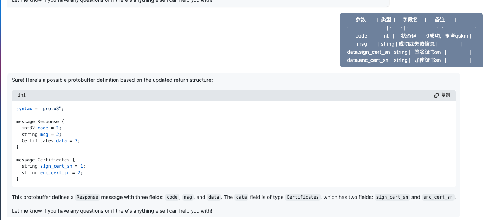
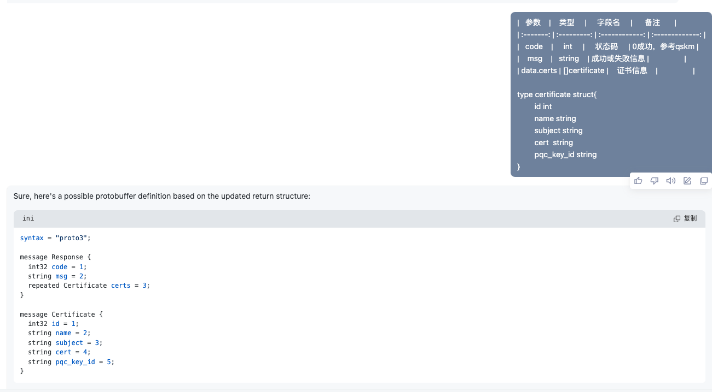

***返回值设计***

|    参数     |  类型  |     字段名     |      备注       |
| :---------: | :----: | :------------: | :-------------: |
|    code     |  int   |     状态码     | 0成功，参考qskm |
|     msg     | string | 成功或失败信息 |                 |
| data.status |  int   |    证书状态    |                 |


```
syntax = "proto3";

message Response {
  int32 code = 1;
  string msg = 2;
  Status data = 3;
}

message Status {
  int32 status = 1;
}
```


***返回值设计***

|       参数        |  类型  |     字段名     |      备注       |
| :---------------: | :----: | :------------: | :-------------: |
|       code        |  int   |     状态码     | 0成功，参考qskm |
|        msg        | string | 成功或失败信息 |                 |
| data.sign_cert_sn | string |   签名证书sn   |                 |
| data.enc_cert_sn  | string |   加密证书sn   |                 |

```
syntax = "proto3";

message Response {
  int32 code = 1;
  string msg = 2;
  Certificates data = 3;
}

message Certificates {
  string sign_cert_sn = 1;
  string enc_cert_sn = 2;
}
```


***返回值设计***

|    参数    |     类型      |     字段名     |      备注       |
| :--------: | :-----------: | :------------: | :-------------: |
|    code    |      int      |     状态码     | 0成功，参考qskm |
|    msg     |    string     | 成功或失败信息 |                 |
| data.certs | []certificate |    证书信息    |                 |

```go
type certificate struct{ 
id int  
name string 
subject string 
cert  string 
pqc_key_id string 
}
```


```
syntax = "proto3";

message Response {
  int32 code = 1;
  string msg = 2;
  repeated Certificate certs = 3;
}

message Certificate {
  int32 id = 1;
  string name = 2;
  string subject = 3;
  string cert = 4;
  string pqc_key_id = 5;
}
```


返回值设计***

|    参数    |     类型      |     字段名     |      备注       |
| :--------: | :-----------: | :------------: | :-------------: |
|    code    |      int      |     状态码     | 0成功，参考qskm |
|    msg     |    string     | 成功或失败信息 |                 |
| data.certs | []certificate |    证书信息    |                 |
| data.total |      int      |    证书数量    |                 |


```
syntax = "proto3";

message Response {
  int32 code = 1;
  string msg = 2;
  CertificateList data = 3;
}

message CertificateList {
  repeated Certificate certs = 1;
  int32 total = 2;
}

message Certificate {
  int32 id = 1;
  string name = 2;
  string subject = 3;
  string cert = 4;
  string pqc_key_id = 5;
}
```

