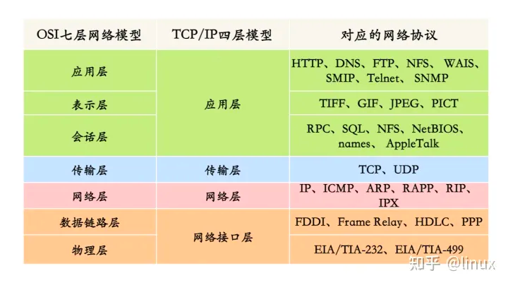
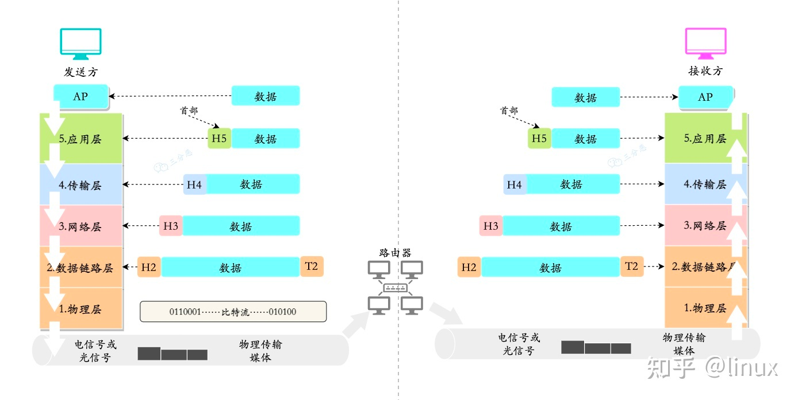
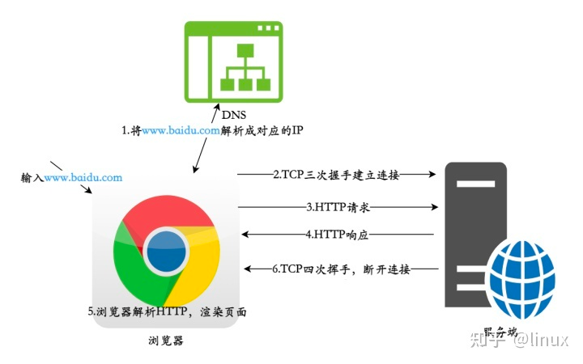
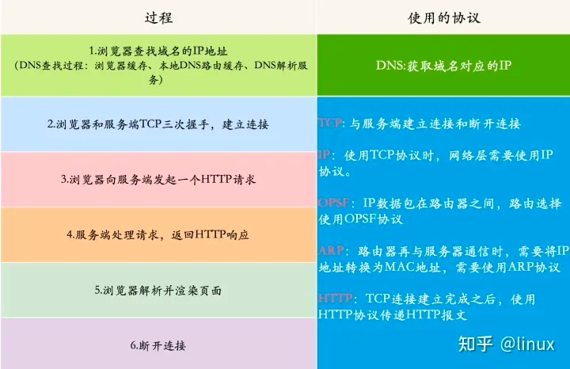
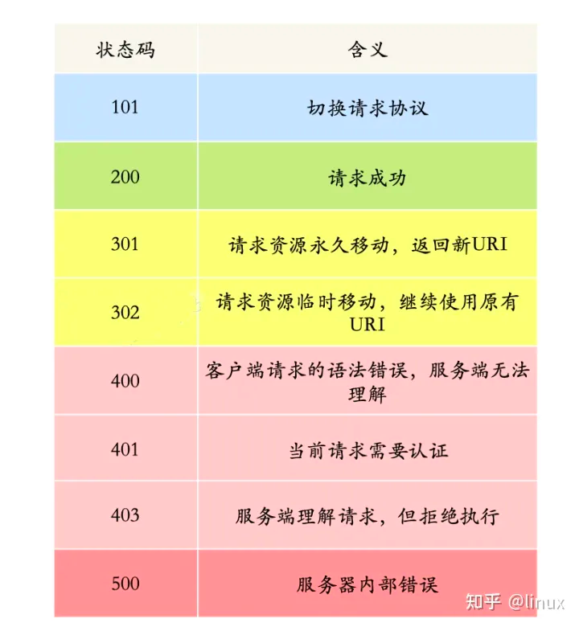
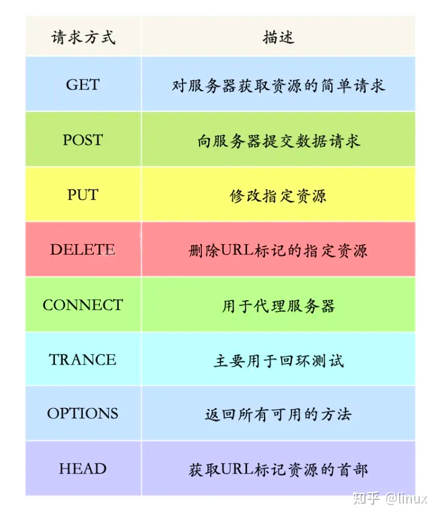

在 TCP 建立连接时，服务端的回复和请求可以放在一起发送给客户端，这是因为在建立连接时，服务端需要响应客户端的 SYN 报文，并发送一个 SYN+ACK 报文给客户端，这两个报文可以放在一起发送。

而在断开连接时，双方需要分别发送 FIN 报文来请求关闭连接，因为每个方向的数据流都是独立的，需要分别进行关闭。
如果双方同时发送 FIN 报文，则无法区分是谁先请求关闭连接，从而可能导致连接关闭不完全或者不确定性的问题。
因此，断开连接时需要分别进行挥手，客户端先发送一个 FIN 报文请求关闭连接，服务端接收到后发送一个 ACK 报文进行确认，然后再发送一个 FIN 报文请求关闭连接，客户端接收到 FIN 报文后再发送一个 ACK 报文进行确认，
这样就完成了四次挥手的过程，确保了连接的正常关闭。

在 TCP 建立连接时，服务端的回复和请求可以放在一起发送给客户端，这是因为在建立连接时，服务端需要响应客户端的 SYN 报文，并发送一个 SYN+ACK 报文给客户端，这两个报文可以放在一起发送。

而在断开连接时，双方需要分别发送 FIN 报文来请求关闭连接，因为每个方向的数据流都是独立的，需要分别进行关闭。
如果双方同时发送 FIN 报文，则无法区分是谁先请求关闭连接，从而可能导致连接关闭不完全或者不确定性的问题。
因此，断开连接时需要分别进行挥手，客户端先发送一个 FIN 报文请求关闭连接，服务端接收到后发送一个 ACK 报文进行确认 ，
然后再发送一个 FIN 报文请求关闭连接，客户端接收到 FIN 报文后再发送一个 ACK 报文进行确认，这样就完成了四次挥手的过程，确保了连接的正常关闭。

## 三次握手，四次挥手
TCP的三次握手是在建立连接时使用的过程，具体步骤如下：
1.客户端向服务器发送SYN（同步）报文，其中SYN标志位被设置为1，同时随机生成一个初始序列号A。
2.服务器接收到SYN报文后，会发送一个SYN/ACK（同步/确认）报文，其中SYN和ACK标志位都被设置为1，确认号设置为A+1，同时随机生成一个初始序列号B。
3.客户端接收到SYN/ACK报文后，会发送一个ACK（确认）报文，其中ACK标志位被设置为1，确认号设置为B+1，序列号设置为A+1。
这样，TCP连接的三次握手就完成了。在这个过程中，客户端和服务器都能够确认对方的发送和接收能力，并且交换了初始序列号，以便进行数据传输。

在 TCP 建立连接时，服务端的回复和请求可以放在一起发送给客户端，这是因为在建立连接时，服务端需要响应客户端的 SYN 报文，并发送一个 SYN+ACK 报文给客户端，这两个报文可以放在一起发送。

在断开连接时需要四次挥手，是因为TCP是全双工协议，每个方向上都需要进行关闭操作。
在断开连接时，首先一方发送FIN（结束）报文，通知对方自己已经没有数据要发送了。对方接收到FIN报文后，会发送一个ACK（确认）报文，表示已经收到了对方的FIN报文。
但此时对方可能还有数据需要发送，因此需要等待一段时间。
当对方所有数据都发送完毕后，会再次发送一个FIN报文，通知自己已经没有数据要发送了。
接收到对方的FIN报文后，再次发送一个ACK报文表示已经收到了对方的FIN报文，并进入TIME_WAIT状态等待一段时间，以确保对方已经收到了自己的ACK报文。
最后，在TIME_WAIT状态结束后，双方可以彻底关闭连接。

# https://zhuanlan.zhihu.com/p/466239718

## 每一层对应的网络协议有哪些？

## 数据在各层之间是怎么传输的呢？

## 从浏览器地址栏输入 url 到显示主页的过程？

这道题，大概的过程比较简单，但是有很多点可以细挖：DNS解析、TCP三次握手、HTTP报文格式、TCP四次挥手等等。

DNS 解析：将域名解析成对应的 IP 地址。
TCP连接：与服务器通过三次握手，建立 TCP 连接
向服务器发送 HTTP 请求
服务器处理请求，返回HTTp响应
浏览器解析并渲染页面
断开连接：TCP 四次挥手，连接结束

我们以输入http://www.baidu.com 为例：

各个过程都使用了哪些协议？

DNS 的解析过程？

## HTTP 常用的状态码及其含义？
HTTP状态码首先应该知道个大概的分类：

1XX：信息性状态码
2XX：成功状态码
3XX：重定向状态码
4XX：客户端错误状态码
5XX：服务端错误状态码

## HTTP 有哪些请求方式？
其中，POST、DELETE、PUT、GET的含义分别对应我们最熟悉的增、删、改、查。

## URI 和 URL 有什么区别?

URI，统一资源标识符(Uniform Resource Identifier， URI)，标识的是Web上每一种可用的资源，如 HTML文档、图像、视频片段、程序等都是由一个URI进行标识的。
URL，统一资源定位符（Uniform Resource Location)，它是URI的一种子集，主要作用是提供资源的路径。
它们的主要区别在于，URL除了提供了资源的标识，还提供了资源访问的方式。这么比喻，URI 像是身份证，可以唯一标识一个人，而 URL 更像一个住址，可以通过 URL 找到这个人——人类住址协议://地球/中国/北京市/海淀区/xx职业技术学院/14号宿舍楼/525号寝/张三.男。
